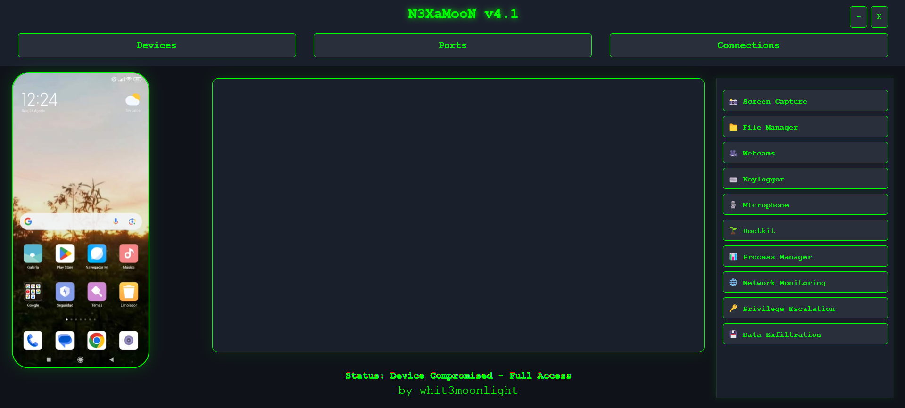

### _by [whit3moonlight](https://github.com/whit3moonlight)_

> **🔒 Herramienta de acceso a dispositivos.**

---

  

## 🚀 Características Principales

### 🛠️ **Control y Manipulación Total del Dispositivo**
- **Backdoor:** Acceso remoto total al dispositivo.
- **🔧 Controlar dispositivo (tiempo real):** Interactúa y controla en vivo.
- **👀 Visualizar dispositivo (tiempo real):** Monitorea el dispositivo remotamente.
- **📱 Generación de APK (anti-desinstalación):** Crea APKs que evaden desinstalación.

### 🎥 **Acceso a Cámaras y Captura**
- **📸 Acceso a cámaras:** Visualiza a través de la cámara del dispositivo.
- **🖼️ Captura de pantalla:** Toma capturas del dispositivo en tiempo real.

### 🗂️ **Gestión de Archivos**
- **💾 Extracción de cookies:** Extrae cookies del dispositivo.
- **📦 Extracción de archivos:** Descarga archivos y los retorna en un archivo .zip.
- **📤 Cargar archivos:** Sube archivos al dispositivo.
- **🗑️ Eliminar archivos:** Borra archivos específicos remotamente.
- **🌐 Explorador de archivos remoto:** Navega por el sistema de archivos desde cualquier lugar.

### 🔐 **Seguridad y Vigilancia**
- **⌨️ Keylogger:** Captura entradas de teclado y las guarda en un `handshake.json`.
- **🔓 Unlock lock screen:** Desbloquea la pantalla del dispositivo.
- **🛠️ Rootkit:** Encubridor.
- **📈 Escalada de privilegios:** Aumenta los privilegios del usuario en el sistema.

### 🌐 **Ataques de Red**
- **📡 Network attack:** Ejecuta múltiples formas de ataques sobre redes.
- **📶 Beacon Attack:** 
  - **SSID personalizado:** Modifica el SSID de la red.
  - **Desconexión forzada:** Deautenticación de clientes de la red Wi-Fi.
  - **Desconexión total:** Desconecta todos los dispositivos de la red.
  
- **💻 Simulación de puntos de acceso falsos:** Implementa ataques MITM (Man-In-The-Middle).

### 🛡️ **Manipulación y Defensa**
- **🚫 Manipulación de antivirus instalados:** Bypass y alteración de software de seguridad.

### 🔍 **OSINT y Recolección de Información**
- **📡 Recolección de información sobre el dispositivo:** Extracción de datos.

---

## 🎬 Demo

  https://github.com/user-attachments/assets/1a1bfeef-87ab-4ba4-932b-d5d5d3cd6ba9

---

`N3XaMooN v4.1` está diseñado para ser una herramienta versátil y poderosa en el ámbito de la **ciberseguridad** y **hacking ético**, con su conjunto de características, ofrece un control total y capacidades de monitoreo sobre dispositivos comprometidos.

---

#whit3moonlight #hacking #ciberseguridad
